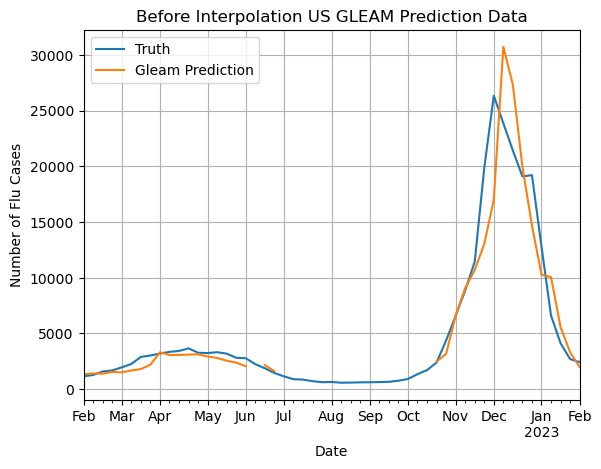
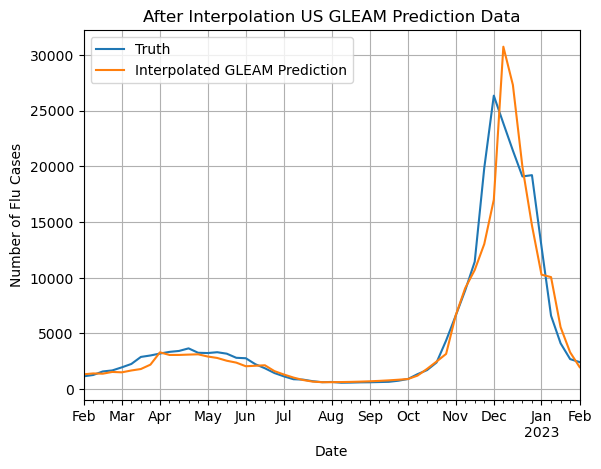
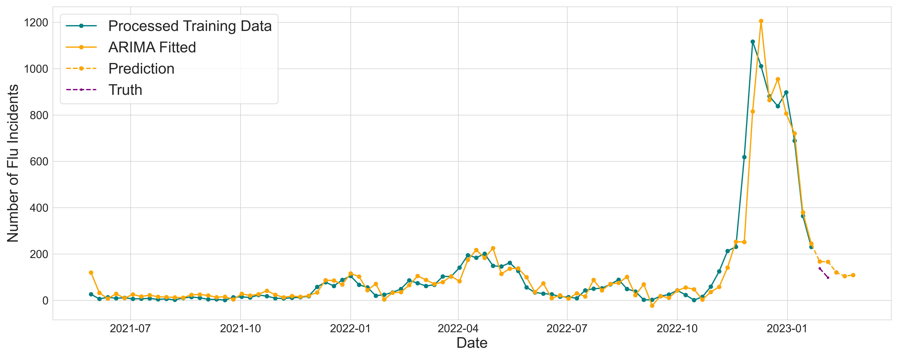
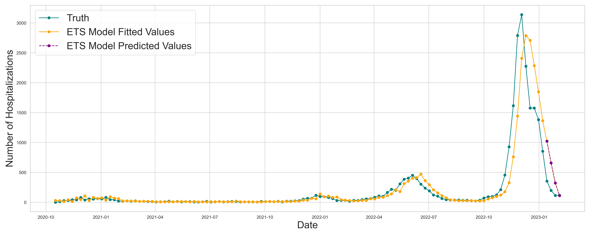
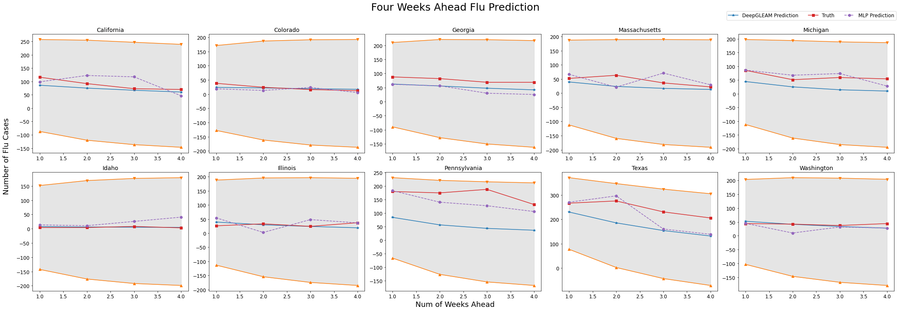
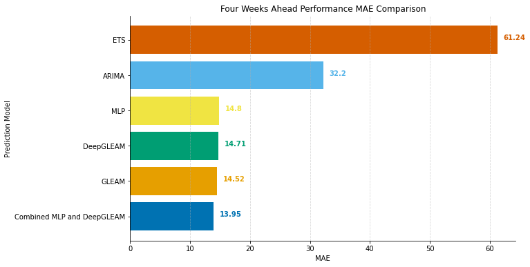

# Optimization of DeepGLEAM on Flu Forecasting Time-Series Data
The current COVID-19 pandemic and common flu highlight the importance of time-sensitive information in biomedical institutions, politics, and economics. The application of data science in creating real-time predictive models is crucial to help researchers and world leaders better understand disease spread and take preventative measures.

## GLEAM Prediction before and after Interpolation



## ARIMA and ETS


## Prediction
Four weeks ahead Flu prediction residual between groundtruth and prediction for 10 states


## Result Comparison 


## Setup, Model training and Model Testing
 
1. Requirements
```bash
>>> pip install -r requirements.txt
```
2. Train models and make prediction (Model already trainned in the submission)
```bash
>>> python3 run.py --config_filename=data/model/dcrnn_cov.yaml
```
3. For Test, run the following command
```bash
>>> ./test.sh
```
- Visualization 

  - After running the command for test, a new folder named plot_weeknumber_result will appear containing [0.025, 0.5, 0.975] residual predictions the .npz files 
  - Select the one with lowest MAE score 
  - Run the flu_forecast_result_plot notebook

## Docker

```bash
>>> docker build -f ./Dockerfile -t Dockerfile .
>>> docker run --rm -it Dockerfile /bin/bash
>>> launch.sh -i xiangyikong/dsc180a:latest #Use this command below to launch the image in DSMLP
```
