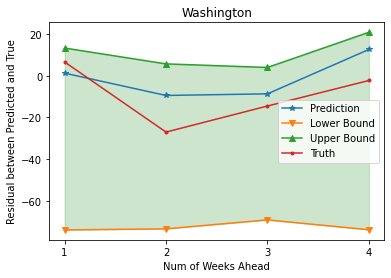

# DSC180A_Q1_Project
DeepGLEAM on COVID-19 and Flu 
## Model output
Four weeks ahead Flu prediction residual between groundtruth and simulation for 1 state


## Setup, Model training and Model Testing
 
1. Requirements
```bash
>>> pip install -r requirements.txt
```
2. Train models and make prediction (Model already trainned in the submission)
```bash
>>> python3 dcrnn_train_pytorch.py --config_filename=data/model/dcrnn_cov.yaml
```
3. For Test, run the following command
```bash
>>> ./test.sh
```
- Visualization 

  - After running the command for test, a new folder named plot_weeknumber_result will appear containing [0.025, 0.5, 0.975] residual predictions the .npz files 
  - Run the flu_forecast_result_plot notebook

## Docker

```bash
>>> docker build -f ./Dockerfile -t Dockerfile .
>>> docker run --rm -it Dockerfile /bin/bash
>>> launch.sh -i xiangyikong/dsc180a:latest
```
